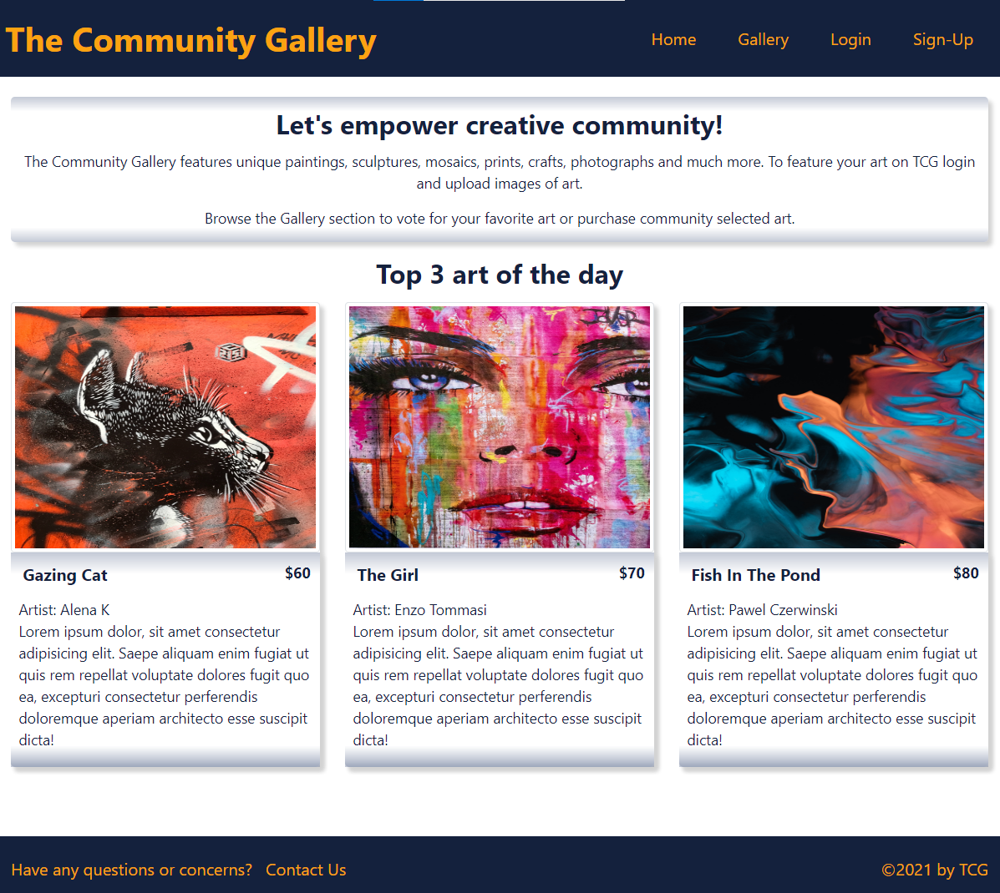
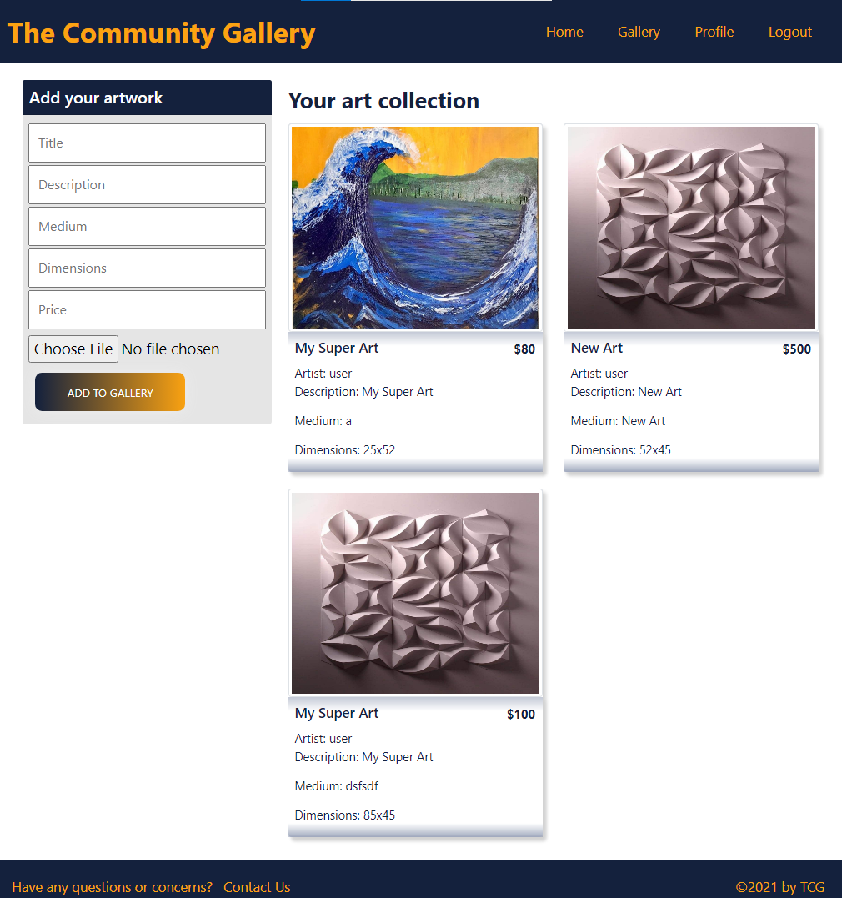
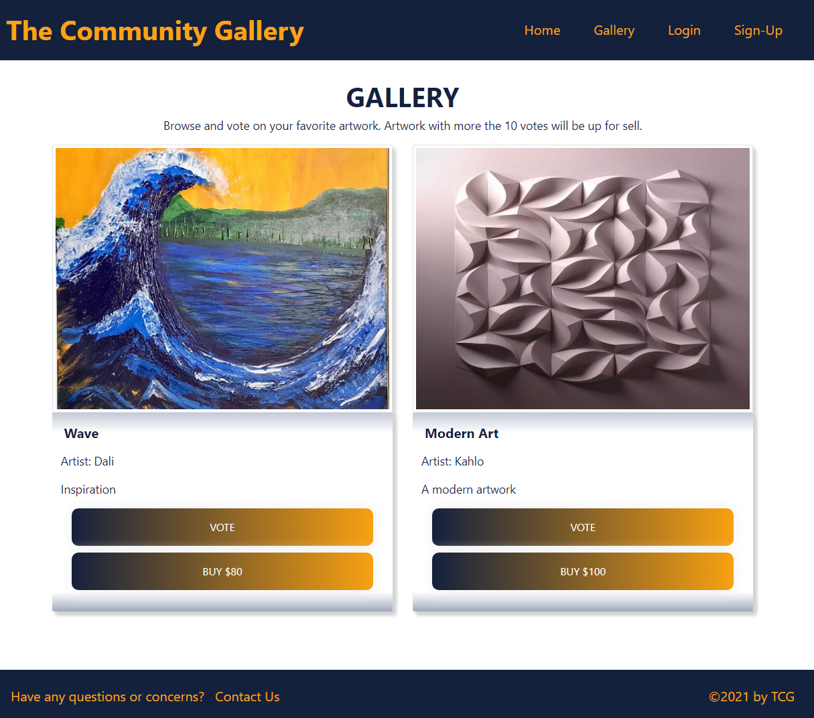

# The Community Gallery - TCG

## Description
An application that will feature unique paintings, sculptures, mosaics, prints, crafts, photographs etc created by the various artists. The artists can sign up and upload their artwork. The art will then be available for users and visitors to vote. Once any art has more than 10 votes it will be available purchase.

## Deployed App

## Screenshots
The Home Page



The Profile Page



The Gallery page




## User Story
````
AS an artist I want to share and sale my art directly to the customer and AS ab art enthusiast I want to buy original artwork recognized by the creative community

````

## Acceptance Criteria
```
GIVEN a web platform
WHEN I visit the application, I am presented with a menu and top 3 most voted art of the day
WHEN I click on Gallery, I am presented with all featured artworks
WHEN I log in, I am able to vote on any artwork and purchase artwork that is available for sale
WHEN an artwork has reached 10 votes, it will be available for sale
When I am logged in, I am able to upload artwork from the profile page and I am able to view all their featured artworks in the profile page 
```

## Technologies
Front-end libraries
- React.js
- Apollo client
- Cloudinary Client

Backend libraries
- Node.js
- Express.js
- Apollo Server
- GraphQL
- MongoDB / Mongoose
- JWT
- Bcrypt

Dev Dependencies
- Nodemon
- Concurrently

## Save project to local
1. Git clone the repo in the desired local folder
````
git clone git@github.com:deepikabekal/Project-3.git
````
2. Cd to the root folder of the project and install all the dependencies (client and server side)
````
npm install
````
3. Request the .env file and insert it in the /server folder. That file contains the jwt secret

## Usage
1. Cd to the root folder and start the project (client and server concurrently)
````
npm run develop
````
2. The client should automatically open at http://localhost:3000
3. To access GraphQL Playground queries and mutations, go to http://localhost:3001/graphql

## Developers
- Deepika B
- Heather S
- Chaitali P
- Lucile T
